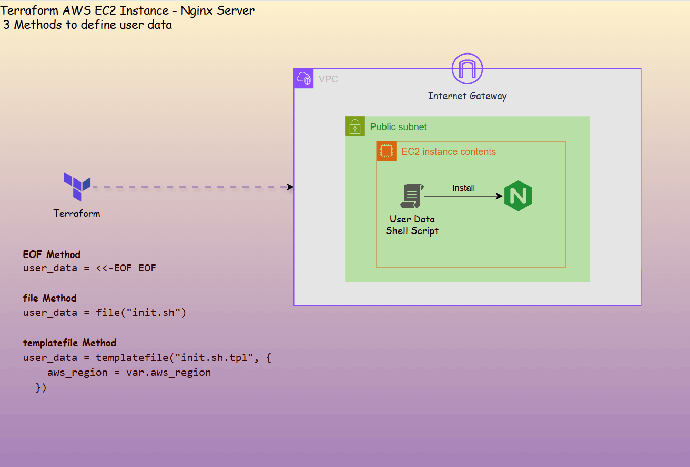
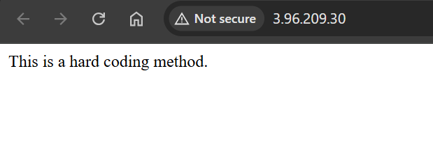
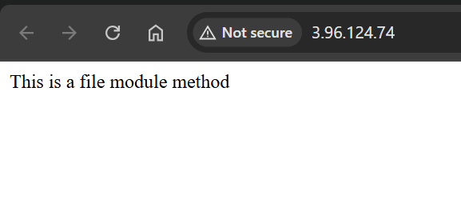
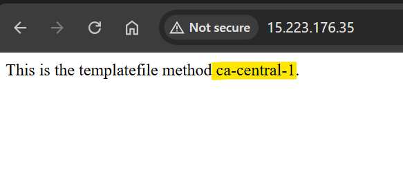

# Terraform AWS EC2 (User Data) Template - Nginx Server

A repo of template to provision EC2 instance to host an Nginx server.

---

## Initialize

```sh
terraform init --backend-config="state.config"
```

---

## User Data Method

- Diagram



---

### EOF Method

- TF configuration

```terraform

    # EOF method
    # "-" is required when indentation is needed.
    user_data = <<-EOF
        #!/bin/bash
        sudo apt update
        sudo apt install -y nginx
        echo "This is a hard coding method." >> /var/www/html/index.html
    EOF

```



---

### `file` Method

- Shell script

```sh
#!/bin/bash

sudo apt update
sudo apt install -y nginx
echo "This is a file module method" > /var/www/html/index.html

sudo systemctl enable --now nginx
```

- TF configuration

```terraform
    user_data = file("${path.module}/../ec2/install_nginx.sh") # file module
```



---

### `templatefile` Method

- tpl file

```sh
#!/bin/bash

sudo apt update
sudo apt install -y nginx
echo "This is the templatefile method ${aws_region}." > /var/www/html/index.html

sudo systemctl enable --now nginx
```

- TF configuration

```terraform
  # templatefile method
  user_data = templatefile("${path.module}/../ec2/init.sh.tpl", {
    aws_region = var.aws_region
  })
```


